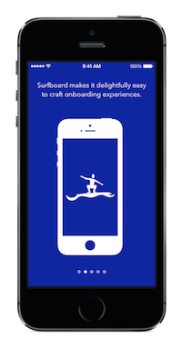
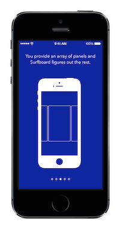

Surfboard
========

Surfboard is a delightful onboarding library for iOS.

Screenshots
---

Dependencies
---
Surfboard was developed with Xcode 5 and the iOS 7 SDK. It uses autolayout and `UICollectionViewController`, so although it hasn't been tested on iOS 6, you may entertain yourself by trying to run Surfboard on it.

Installing Surfboard
---
Add the contents of the SRFSurfboard project to your directory, or use Cocoapods:

`pod 'Surfboard'`

Import `SRFSurfboard.h` to get access to all of the great features of Surfboard.

Getting Started
---
When we talk about Surfboards, we talk about a set of panels. Each panel is a screenful of information, including some text, an image or screenshot, and optionally, a button. 

Take a look at the Sample Data directory for an idea of what a sample JSON configuration looks like.

Showing a Surfboard
---
You can show a surfboard by using a segue, or by creating a an instance of `SRFSurfboardViewController` and passing it an array of some panels. You can also pass a path to a JSON file, which we'll discuss in just a second.

The two initializers for a surfboard:

	//	One surfboard, the initWithPanels: way.
	
	SRFSurfboardViewController *surfboard = [[SRFSurfboardViewController alloc] initWithPanels:anArrayOfPanels];
	
	//	Another surfboard, the initWithPathToCofiguration way.
	
	SRFSurfboardViewController *surfboard = [[SRFSurfboardViewController alloc] initWithPathToConfiguration:aPathToJSONFile];
	
Creating Panels
---
Panels can be created programatically, or using a JSON file. The JSON format is simple. There are four keys:

1. **text** The text that appears at the top of the panel.
2. **image** An image to show in the panel. The image is tinted to the `tintColor` of the surfboard.
3. **screen** A screenshot to show in the panel. The screenshot is not tinted.
4. **button** The title of a button to show at the bottom of the panel. This is optional.

Note that either the contents of the "image" or "screen" will be used, but not both. Supplying both results in undefined behavior.

Here's a sample panel:

	{
		"text" : "Welcome to Surfboard.",
		"image" : "swipe"
	}

You'd want to add an image to your bundle or asset catelog named "swipe.png" and Surfboard would display it.

License
---
SRFSurfboard is released under the MIT license. See [LICENSE](./LICENSE) for more.

More Open Source
---
If you like SRFSurfboard, you may like some of [my other projects](https://github.com/MosheBerman?tab=repositories) on GitHub.

	

